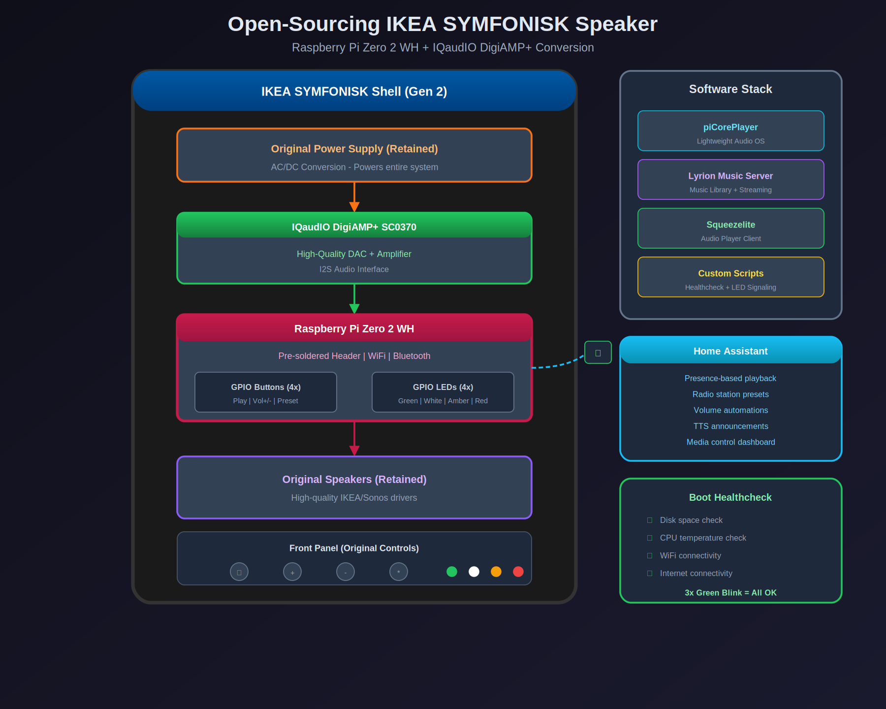

# opensymf

Open-source conversion of IKEA SYMFONISK and Sonos speakers to Raspberry Pi-based audio players — escaping vendor lock-in while keeping the original hardware.



## The Fleet

Seven speakers converted across the house, all running [piCorePlayer](https://www.picoreplayer.org/) with [Lyrion Music Server](https://lyrion.org/) (formerly Logitech Media Server) and integrated with [Home Assistant](https://www.home-assistant.io/).

| Qty | Speaker | DAC/Amp | GPIO Integration | Status |
|-----|---------|---------|------------------|--------|
| 4×  | IKEA SYMFONISK Bookshelf (Gen 2) | IQaudIO DigiAMP+ SC0370 | Buttons + LEDs | ✅ Complete |
| 2×  | IKEA SYMFONISK Picture Frame | IQaudIO DigiAMP+ SC0370 | Audio only | ⚠️ Partial |
| 1×  | Sonos Play:5 (Gen 1) | HiFiBerry DAC+ | N/A (line-in) | ✅ Complete |

All speakers run on a **Raspberry Pi Zero 2 WH** (pre-soldered header variant).

## Why?

Sonos [ended support](https://en.wikipedia.org/wiki/Sonos#End-of-life_controversy) for older speakers including the Play:5 Gen 1, effectively stranding them on a frozen S1 platform with no future updates or integration with newer devices. IKEA SYMFONISK speakers, being Sonos-based internally, face the same fate. This project replaces the proprietary brains while keeping the original power supplies, speaker drivers, buttons, and LEDs intact.

## Two Conversion Approaches

**SYMFONISK speakers** → The original Sonos board handles everything (DAC + amplification), so the **IQaudIO DigiAMP+** replaces both functions and drives the passive speaker drivers directly through its screw terminals.

**Sonos Play:5 Gen 1** → Already has five Class-D amplifiers, six drivers, and a line-in jack. A **RPi Zero + HiFiBerry DAC+** plugged into the line-in was all it needed — the original board is still inside, completely untouched.

For full hardware details and ALSA configuration, see [docs/HARDWARE.md](docs/HARDWARE.md).

## Repository Structure

```
opensymf/
├── README.md
├── LICENSE
├── scripts/
│   ├── boot_health_check.sh      # Post-boot system health checks
│   ├── sbpd-script.sh            # Physical button daemon
│   └── led_monitor_squeezelite.sh # Continuous LED status monitor
└── docs/
    ├── GPIO_PINOUT.md            # Full pinout reference (mapped via multimeter)
    ├── HARDWARE.md               # HAT specs, ALSA config, sourcing
    ├── images/                   # Architecture diagram, PCB photos
    ├── datasheets/               # IQaudIO & DigiAMP+ product briefs
    └── reference/                # piCorePlayer docs, Pi pinout
```

## Scripts

All scripts are designed for piCorePlayer's Tiny Core Linux environment. They execute at boot in the following order (configured via piCorePlayer web UI → Tweaks → User commands):

### 1. `boot_health_check.sh`

Post-boot health checks with LED feedback:

| Check | Threshold | Source |
|-------|-----------|--------|
| Disk usage | < 90% | `df /` |
| CPU temperature | < 75°C | `/sys/class/thermal/thermal_zone0/temp` |
| WiFi connectivity | wlan0 has IP | `ifconfig wlan0` |
| Internet reachability | ping succeeds | `ping 8.8.8.8` |

Result: **3× green blink** = all passed, **3× red blink** = failure.

### 2. `sbpd-script.sh`

Initializes [sbpd (Squeeze Button Pi Daemon)](https://github.com/coolio107/SqueezeButtonPi-Daemon) to map the front-panel buttons to Squeezelite commands via GPIO:

| Button | GPIO | Short Press | Long Press |
|--------|------|-------------|------------|
| Play/Pause | 27 | PLAY | PLAY |
| Volume + | 23 | VOL+ | VOL+ (repeat) |
| Volume - | 24 | VOL- | VOL- (repeat) |

### 3. `led_monitor_squeezelite.sh`

Continuous monitoring loop (5-second interval) driving the status LEDs:

| LED | Meaning |
|-----|---------|
| ⚪ White | Normal — Squeezelite running, server reachable |
| 🟡 Amber | Warning — Squeezelite not running, server reachable |
| 🔴 Red | Error — Server unreachable |

## WiFi Recovery

The biggest operational headache with WiFi-connected Pis is connection drops. A progressive self-healing recovery system is integrated into the monitoring:

1. WiFi power management disabled at startup (`iwconfig wlan0 power off`)
2. After 1 min of failures → `wpa_cli reassociate`
3. After 3 min → full WiFi interface restart
4. After 5 min → system reboot (max 3 attempts — prevents boot loops)

All recovery attempts logged to `/tmp/wifi_recovery.log`.

## GPIO Mapping

The SYMFONISK Bookshelf Gen 2 front panel uses a **WOW B NFC/KEY BOARD P0.3** (16-pin FPC, 1.0mm pitch). None of this is documented by IKEA/Sonos — every pin was traced with a multimeter.

See [docs/GPIO_PINOUT.md](docs/GPIO_PINOUT.md) for the complete pinout table, wire colors, and photos.

Quick reference:

| Component | GPIO | Function |
|-----------|------|----------|
| Green LED | 13 | Health check OK |
| White LED | 5 | Normal operation |
| Amber LED | 17 | Squeezelite warning |
| Red LED | 6 | Server error |
| Play/Pause | 27 | Player control |
| Volume + | 23 | Volume up |
| Volume - | 24 | Volume down |

## Installation

These scripts target piCorePlayer's Tiny Core Linux environment.

```bash
# Copy scripts to the speaker
scp scripts/*.sh tc@<speaker-ip>:/home/tc/

# SSH in
ssh tc@<speaker-ip>

# Make executable
chmod +x /home/tc/*.sh

# Configure boot execution order in piCorePlayer web UI:
#   Tweaks > User commands:
#     /home/tc/boot_health_check.sh
#     /home/tc/sbpd-script.sh
#     /home/tc/led_monitor_squeezelite.sh

# IMPORTANT: persist changes to the RAM-based filesystem
pcp bu
```

### Configuration

Edit `led_monitor_squeezelite.sh` to set your Lyrion Music Server IP:

```bash
SERVER_IP="192.168.181.102"   # Change to your LMS IP
SERVER_PORT=9090              # Default LMS CLI port
```

> ⚠️ **piCorePlayer runs entirely from RAM.** Always run `pcp bu` after making changes, or they will be lost on reboot. Be especially careful with `tar` operations — incorrect usage can corrupt the system, requiring physical SD card removal for recovery.

## Software Stack

| Component | Purpose |
|-----------|---------|
| [piCorePlayer](https://www.picoreplayer.org/) | Lightweight audio OS (RAM-based) |
| [Lyrion Music Server](https://lyrion.org/) | Music library and streaming |
| [Squeezelite](https://github.com/ralph-irving/squeezelite) | Audio player client |
| [sbpd](https://github.com/coolio107/SqueezeButtonPi-Daemon) | Physical button daemon |
| [Home Assistant](https://www.home-assistant.io/) | Automation, TTS, presence-based playback |

## Known Issues

- **SYMFONISK Picture Frame**: the ribbon cable dimensions are incompatible with the bookshelf version's FPC connector, and the LED appears to be a different type (likely addressable). Audio works fine via the DigiAMP+, but button/LED GPIO integration is not yet implemented.
- **piCorePlayer fragility**: the RAM-based architecture is unforgiving — one bad config change and you're pulling the SD card. Always backup before changes.
- **WiFi power management**: the Pi's default power-saving mode causes frequent disconnects. Disable it at boot or the speakers will drop off the network.

## Inspiration & References

- [MagPi Magazine #139 — "Upcycle a Sonos Play:1"](https://magpi.raspberrypi.com/issues/139) by PJ Evans (pages 62-65): step-by-step Play:1 conversion using Raspberry Pi 3A + JustBoom DAC & AMP
- [piCorePlayer documentation — Control by rotary encoders and buttons](https://docs.picoreplayer.org/)
- [sbpd (SqueezeButtonPi-Daemon)](https://github.com/coolio107/SqueezeButtonPi-Daemon)
- [Jivelite key commands reference](https://github.com/ralph-irving/tcz-lirc/blob/master/jivekeys.csv)

## License

MIT
