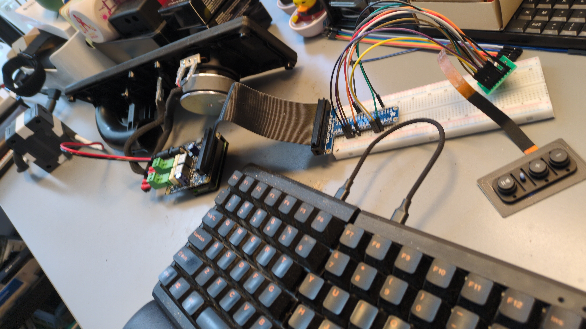
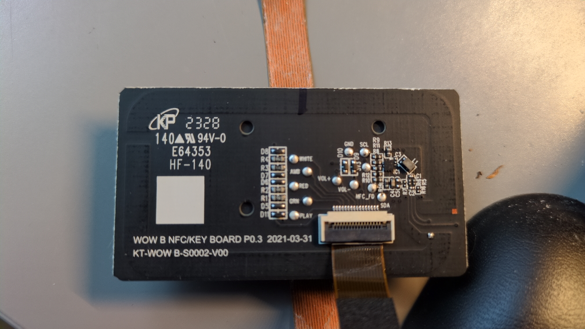
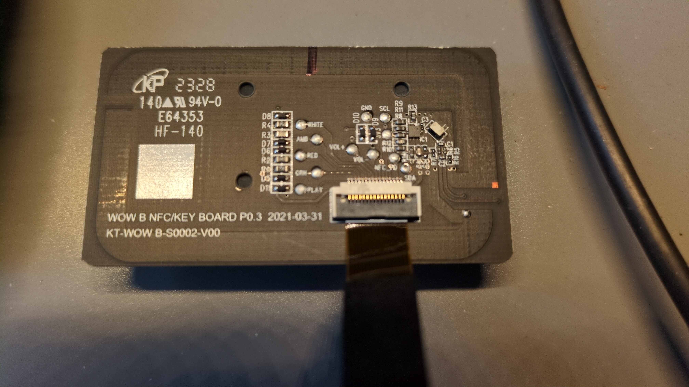

# GPIO Pinout — IKEA SYMFONISK Bookshelf Speaker (Gen 2)

## Front Panel PCB

The SYMFONISK Bookshelf Gen 2 uses a front panel PCB identified as:

- **Board:** WOW B NFC/KEY BOARD P0.3
- **Date:** 2021-03-31
- **Part:** KT-WOW B-S0002-V00
- **Connector:** 16-pin FPC (Flexible Printed Circuit), 1.0mm pitch

This board carries 4 LEDs, 3 buttons (play/pause, vol+, vol-), an NFC antenna pad, and I²C lines (SDA/SCL). The board connects to the main Sonos PCB via a 16-pin ribbon cable.

## Pinout Table

Mapped via multimeter. Pin numbering is from the **connector side** of the FPC board (the side with the ribbon cable socket).

| FPC Pin | Signal   | RPi GPIO | RPi Pin | Wire Color | Notes                    |
|---------|----------|----------|---------|------------|--------------------------|
| 01      | PLAY     | —        | —       | N/A        | Duplicate of pin 02      |
| 02      | PLAY     | GPIO 27  | Pin 13  | Blue       | Play/Pause button        |
| 03      | GRN      | GPIO 13  | Pin 33  | Green      | Green LED (health check) |
| 04      | RED      | GPIO 6   | Pin 31  | Red        | Red LED (error)          |
| 05      | GND      | GND      | Pin 34  | Black      | Ground                   |
| 06      | AMB      | GPIO 17  | Pin 11  | Orange     | Amber LED (warning)      |
| 07      | GND      | —        | —       | N/A        | Not connected            |
| 08      | WHITE    | GPIO 5   | Pin 29  | White      | White LED (normal)       |
| 09      | VOL+     | GPIO 23  | Pin 16  | Purple     | Volume up button         |
| 10      | VOL-     | GPIO 24  | Pin 18  | Grey       | Volume down button       |
| 11      | 3V3      | 3.3V     | Pin 17  | Yellow     | Power supply for LEDs    |
| 12      | SCL      | —        | —       | N/A        | I²C clock (unused)       |
| 13      | SDA      | —        | —       | N/A        | I²C data (unused)        |
| 14      | GND      | —        | —       | N/A        | Not connected            |
| 15      | NFC_FD   | —        | —       | N/A        | NFC field detect (unused)|
| 16      | GND      | GND      | Pin 09  | Black      | Ground                   |

> **Note:** Pin numbering reverses depending on which side of the board you're looking at. The table above uses the connector-side orientation. See the reverse mapping in the raw notes if needed.

## Wiring Summary

### LEDs (active-high outputs)

| LED    | GPIO | Color Code | Function                          |
|--------|------|------------|-----------------------------------|
| Green  | 13   | Green      | Boot health check passed          |
| White  | 5    | White      | Normal operation                  |
| Amber  | 17   | Orange     | Squeezelite issue                 |
| Red    | 6    | Red        | Server unreachable                |

### Buttons (active-low inputs with internal pull-up)

| Button     | GPIO | Color Code | Function        |
|------------|------|------------|-----------------|
| Play/Pause | 27   | Blue       | Play/pause      |
| Volume +   | 23   | Purple     | Volume up       |
| Volume -   | 24   | Grey       | Volume down     |

### Power

| Signal | Source   | Color Code |
|--------|----------|------------|
| 3.3V   | RPi Pin 17 | Yellow  |
| GND    | RPi Pin 09 | Black   |
| GND    | RPi Pin 34 | Black   |

## Unused Pins

The following signals are present on the FPC but not used in this conversion:

- **NFC_FD** (pin 15): NFC field detection — the board has an NFC antenna pad (the silver square). Not used since we're not implementing NFC tag features.
- **SDA/SCL** (pins 12-13): I²C bus — likely used by Sonos for communication with the main board. Not needed for our GPIO-based approach.
- **Duplicate PLAY** (pin 01): Second play button connection — redundant, only one GPIO needed.

## Picture Frame Speaker (SYMFONISK Schilderijlijst)

The picture frame model uses the same DigiAMP+ setup for audio, but the front panel ribbon cable has **different dimensions** (incompatible with the bookshelf FPC connector). The LED appears to be a different type (potentially addressable/RGB rather than individual GPIO-driven LEDs). Button and LED GPIO integration is **not yet implemented** for this variant.

## Photos

### GPIO prototyping workbench

*Mapping the SYMFONISK front panel: gutted speaker shell with DigiAMP+ and driver (left), FPC ribbon cable to breakout board on breadboard (center), original button panel (right)*

### Front panel PCB — close-up

*WOW B NFC/KEY BOARD P0.3 — labeled test points for each LED (WHITE, AMB, RED, GRN), button (VOL+, VOL-, PLAY), and bus signals (GND, SCL, SDA, NFC_FD). The silver square (top left) is the NFC antenna pad.*

### Front panel PCB — overview

*Same board, wider angle showing the 16-pin FPC ribbon cable connector*
